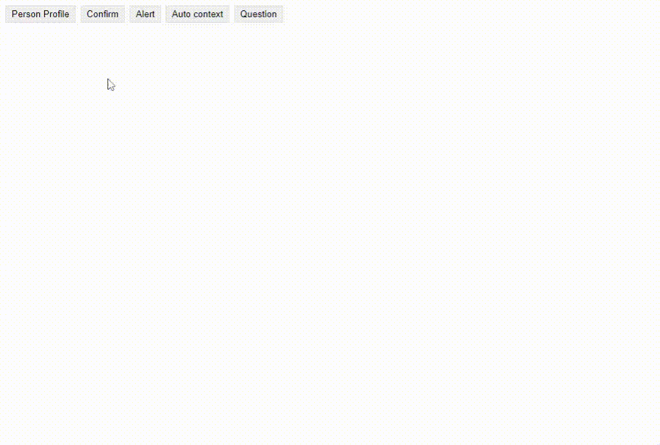

# Jenesius Vue Modal

Jenesius vue modal is simple modal system library for **Vue 3** only . 


Using this library, you can simply show both one and several modal windows at the same time, integrate with vue-router

- [Full Documentation](https://modal.jenesius.com)
- [Examples](https://modal.jenesius.com/examples/list.html)


### Installation

```shell
npm i jenesius-vue-modal
```



----


The main condition for library initialization is adding a **container** inside your App.vue file. Note that this container only needs to be **mounted once** in the main parent component. Opened **modals** will be shown inside this container.

`App.vue`
```vue
<template>
    <widget-container-modal />
</template>
<script>
    import {container} from "jenesius-vue-modal";
    
    export default {
        components: {WidgetContainerModal: container},
        name: "App"
    }
</script>
```


## Modal show

Methods `openModal` and `pushModal` used to display modal windows. 
- `openModal` - close all previous modals and then display provided component.
- `pushModal` - display provided component

```js
import {openModal} from "jenesius-vue-modal";
import SomeVueComponent from "SomeVueComponent.vue";
    
openModal(SomeVueComponent, props);
```
- props will provide in your component, [example](#example-vuemodalcomponent)

Methods return promise, in this case promise is resolved **modalObject**.
[More information](https://modal.jenesius.com/docs.html/details#modal-object)
```js
const modal = await openModal(SomeVueComponent);
// modal {id, close, onclose, closed, instance, on}
```


## Methods

- `openModal` - close all modals and then open provided modal.
- `pushModal` - add one more provided modal.
- `closeModal`- close all modals.
- `popModal` - close last opened modal.
- `promptModal` - opening a modal window and waiting for a value to be returned. [More information](https://modal.jenesius.com/guide/guide-methods.html#prompt-modal)

For detailed information about existing methods, follow the [link](https://modal.jenesius.com/docs.html/methods)

```js 
import {openModal, pushModal, closeModal, popModal} from "jenesius-vue-modal"
```

## Handle events

Using modalObject you can handle any events:
```vue

// Modal.vue
<template>
    <button @click = "emit('update', value)"></button>
</template>
```
When we click on the button we can handle event using `modal.on(eventName, callback)`
```js
const modal = await openModal(Modal, {value: 123});
modal.on('update', v => {
    console.log(v); // 123
})
```

## Lifecycle Hooks

**All** hooks use only returned value(Boolean) for navigation hooks.
If function return **false** or throwing an Error modal window will not be closed.

There are three ways to track the closing of a modal:

- onclose
```js
const modal = await openModal(Modal, {title: "welcome"});
modal.onclose = () => {
    console.log("Close");
    return false; //Modal will not be closed
}
```
or if using function declaration you have access to modal **Instance** by *this*.
This declaration provide way to view data within the modal in the parent's onclose() method:

```js
//Modal.vue
{
    props: {title: String},
    data : () => ({info: "Version x.x.x"}),
    methods: {
        update(){}
    }
}
//...
modal.onclose = function(){
    // Has access to the context of the component instance this.
    this.title; // "welcome"
    this.info;  // "Version x.x.x"
    this.update();
}
```

- default component

```js
export default {
    props: {},
    data: () => ({isValidate: false}),
    beforeModalClose(){
        if (!isValidate) return false; //modal will not be closed while isValidate === false
    }
}
```
- Composition style
```js
import {onBeforeModalClose} from "jenesius-vue-modal"
export default{
    setup() {
        onBeforeModalClose(() => {
            console.log("Close");
        });
    }
}
```


### Async/Await

Hooks also can be asynchronous functions:
```js
async beforeModalClose(){
    await doSome();
    return false; // This modal can not be closed!
}
```
or

```js
beforeModalClose(){
    return Promise(resolve => {
        setTimeout(() => resolve(true), 2000); //Modal will closed after 2 second
    })
}
```

# Integration with VueRouter

For integrate modals into VueRouter you need to initialize your application:

- Provide router to the **useModalRouter**:

```js
import {createWebHistory, createRouter} from "vue-router";
import {useModalRouter} from "jenesius-vue-modal";

const router = createRouter({
    history: createWebHistory(), 
    routes: [...],
});

useModalRouter.init(router); //Saving router
```

- Wrap your component in a route handler:
```js
import Modal from "Modal.vue"

const routes = [
    {
        path: "/any-route",
        component: useModalRouter(Modal) // Wrap of your VueComponent
    }
]
```

Now, when route will be */any-route* the Modal window will open.
For more information see [Docs](https://modal.jenesius.com/docs.html/integration-vue-router).

# Style and Animation
Please refer to the [documentation](https://modal.jenesius.com/docs.html/details#styles) to change the styles or animations of modals.

# Example VueModalComponent

`WidgeTestModal.vue`
```vue 
<template>
    <p>{{title}}</p>
</template>
<script>
    export default {
        props: {
            title: String
        }
    }
</script>
```
To show this component
```js
import {openModal} from "jenesius-vue-modal"
import WidgeTestModal from "WidgeTestModal.vue";

openModal(WidgeTestModal, {
    title: "Hello World!"
});
```

---

#### Do you like this module? Put a star on [GitHub](https://github.com/Jenesius/vue-modal)
